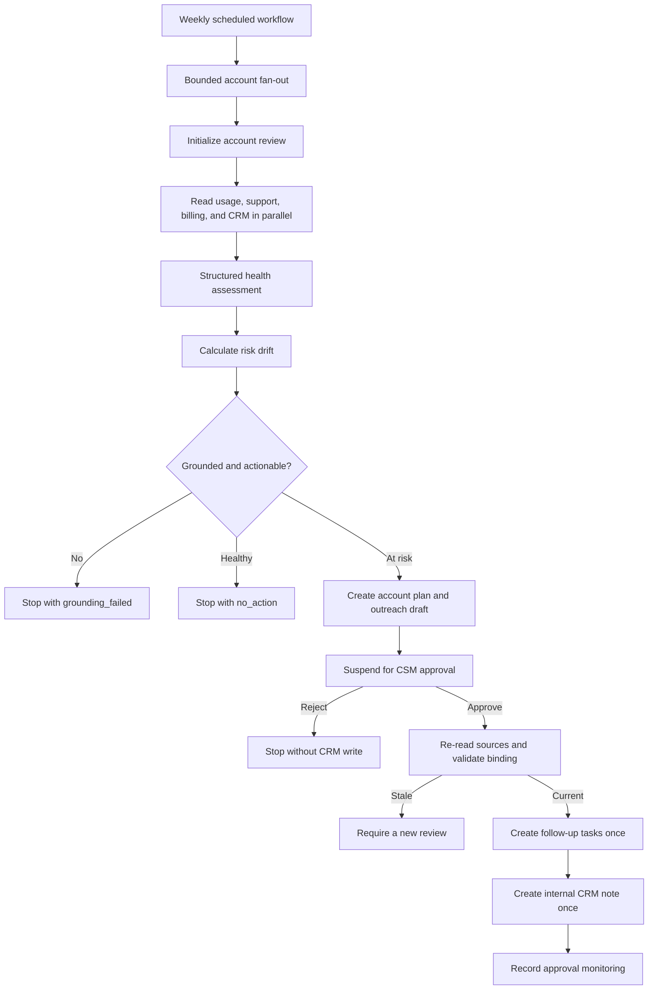

# Mastra primitives used by this template

This template combines Mastra's scheduling, workflows, agents, memory, tools,
structured output, approval, retries, request context, scorers, and
observability into one customer-success operating loop. This document maps each
primitive to the code that uses it and explains its role in the safety model.

## End-to-end flow



The workflow never sends customer-facing outreach. It stores the outreach as
an internal draft for a CSM to review and send through their normal process.

## Scheduled workflows

`src/mastra/workflows/scheduled-workflow.ts` defines
`weekly-customer-success` with Mastra's `createWorkflow` and `schedule`
configuration.

- `CUSTOMER_SUCCESS_CRON` controls the cron expression. The default is Monday
  at 09:00.
- `CUSTOMER_SUCCESS_TIMEZONE` controls the schedule timezone. The default is
  UTC.
- The scheduled trigger has no user-supplied fields; tenant ID comes from
  configuration.
- The fan-out step lists accounts through the active CRM adapter.
- `MAX_ACCOUNT_CONCURRENCY` bounds parallel account execution between 1 and 25.
- Each account receives its own workflow run ID and failure boundary. One
  provider failure does not abort the other accounts.
- A suspended account counts as a successfully started review because it is
  intentionally waiting for a CSM.

The scheduled workflow delegates account decisions to
`customer-success-account`; it does not duplicate assessment or approval logic.

## Account workflow, steps, and retries

`src/mastra/workflows/account-workflow.ts` exposes the operational stages in
Studio. The source layer contains four real parallel steps:

- `read-product-usage`;
- `read-support-history`;
- `read-billing-status`;
- `read-crm-notes`.

The workflow then assembles the typed snapshot, assesses health and risk,
calculates drift, creates the account plan, drafts outreach, binds the approval
artifacts, and records assessment monitoring. `request-csm-approval` suspends
the run and exposes the approval request as its payload.

After resume, `validate-approval-freshness` re-reads all sources before any
write. A current approval continues through separate
`create-crm-follow-up-tasks` and `create-crm-internal-note` steps, followed by
`record-approval-monitoring`. Rejections, healthy accounts, insufficient data,
and failed grounding continue through the same graph as explicit no-write
outputs, so every run remains inspectable.

Each source-read step declares `retries: 2`, as does the scheduled fan-out.
Mastra therefore permits three total attempts at each retry boundary. A
retryable provider failure is raised as `ProviderUnavailableError` during the
retry budget; after the final attempt, the run returns the explicit
`unknown_retry` outcome instead of pretending unavailable data is empty. The
two CRM write steps also retry safely because their operations use durable
idempotency markers and write intents.

## Structured outputs and Zod contracts

Workflow and tool boundaries are Zod-validated. Shared domain contracts such as
source records, assessments, plans, outreach drafts, monitoring events, and CRM
write results live in `src/mastra/schemas/index.ts`; the scheduled workflow,
account workflow, and CRM tools also declare boundary-specific input and output
schemas alongside their implementations.

In model mode, `src/mastra/adapters/model/mastra-intelligence.ts` calls the
Mastra agent with `structuredOutput` for three distinct artifacts:

- a health assessment;
- an account plan;
- an outreach draft.

Structured output validates shape, but it is not the final safety boundary.
`src/mastra/services/grounding.ts` independently resolves every evidence
reference against the normalized source snapshot, replaces generated narrative
with readable canonical evidence-backed text, and rejects unsupported,
free-text, redacted, empty, null, or `unknown` evidence.

Request identity is authoritative. Tenant ID comes from configuration, the
account ID comes from the workflow input (prefilled with the at-risk fixture in
Studio), and `asOf` comes from the workflow clock. Those values overwrite
model-produced identity before artifacts can reach memory, approval, or CRM
writes.

## Agent

`src/mastra/agents/customer-success-agent.ts` creates the Mastra `Agent` used
when `GENERATION_MODE=model`.

- `MODEL` selects the model-router identifier.
- Agent instructions require exact record and field evidence, prohibit invented
  customer intent, and keep outreach draft-only.
- `maxRetries: 2` applies to model generation failures.
- Assessment, planning, and outreach use separate memory thread IDs while
  sharing the same account resource scope.

The Studio workflow uses model-backed intelligence by default. Fixture scripts
and CI use deterministic intelligence so automated verification remains
repeatable and does not require repository secrets. The workflow, grounding,
approval, monitoring, and CRM contracts are the same in both modes.

## Working memory

Mastra working memory is configured through `Memory` in
`src/mastra/agents/customer-success-agent.ts`.

- It is always enabled in model mode.
- Its scope is `resource`, where the resource key combines tenant and account.
- Its model-managed template offers advisory fields for current verified risks,
  previously described actions, and open CSM questions.
- The agent also receives the last ten messages for its scoped thread.

This optional context can help generation remain consistent across reviews. It
is not synchronized after the later approval step, so it is not the
authoritative source for approved actions, risk-score drift, or approval state.

## Observational memory

Observational memory is opt-in with:

```env
ENABLE_OBSERVATIONAL_MEMORY=true
```

When enabled, Mastra uses the configured model to create observations and
buffers them when the resource becomes idle. It can improve long-running
account context, but it adds model calls and cost. It remains advisory; the
typed operational store still controls decisions.

## Semantic recall

Semantic recall is opt-in with:

```env
ENABLE_SEMANTIC_RECALL=true
EMBEDDING_MODEL=openai/text-embedding-3-small
```

The memory configuration retrieves the top three resource-scoped matches with
a one-message surrounding range. `LibSQLVector` uses the same database URL and
optional Turso authentication as the main Mastra storage. The selected
embedding provider must have valid credentials.

`npm run demo:model-memory` exercises working memory, observational memory,
semantic recall, repeated assessment, and usage/cost capture together.

## Authoritative operational memory

`src/mastra/memory/operational-stores.ts` implements a separate typed memory
layer for business-critical state:

- account assessment and drift history;
- the last account plan;
- approval requests and decisions;
- idempotency records;
- durable CRM write intents;
- monitoring events.

Production composition uses LibSQL; fixture tests use the in-memory
implementation of the same interfaces. Account history keeps the latest 12
assessment entries and is isolated by a length-delimited tenant/account scope
key.

The distinction is intentional: Mastra model memory helps the agent reason,
while operational memory determines drift, approval freshness, and exactly-once
CRM behavior.

## Request context

Mastra `RequestContext` carries trusted identity without adding it to generated
content.

- Scheduled runs set `tenant-id` and `account-id` before starting each account
  workflow.
- The initialization step rejects tenant identity that conflicts with
  configuration or account identity that conflicts with workflow input.
- A host application can set `csm-id` during resume. The approval step then
  requires `approverId` to match it.
- Observability retains `tenant-id` and `account-id` as request-context keys for
  trace correlation.

Only trusted middleware should populate these values. User-provided text should
not be copied into RequestContext identity keys.

## Approval and suspend/resume

The approval gate uses Mastra workflow suspension rather than a blocking loop.
When an account requires action, the workflow persists an approval request and
suspends with:

- the artifact bundle hash;
- the assessment `asOf` timestamp;
- the request time;
- the maximum expiry time.

The Studio resume payload includes only the CSM decision, approver identity,
and optional feedback. The workflow constructs decision time, expiry, and the
hidden artifact bindings from its clock and persisted request. Before writing,
the service checks the exact hash binding, timestamp bounds, current source
snapshot hash, and optional RequestContext approver identity.

Approval normally happens in Mastra Studio or a host application that calls the
workflow resume API. A CRM-native approval button is an optional adapter to the
same resume operation.

## CRM tools

`src/mastra/tools/crm-tools.ts` registers three provider-neutral Mastra tools:

| Tool                                    | Purpose                                          | Approval                      |
| --------------------------------------- | ------------------------------------------------ | ----------------------------- |
| `list-customer-accounts`                | List normalized accounts                         | Read-only                     |
| `read-customer-crm-notes`               | Read normalized notes for one account and window | Read-only                     |
| `write-approved-customer-success-draft` | Write an approved internal draft and tasks       | Mastra tool approval required |

The tools depend on `CrmRepository` and `CrmWriter`, not HubSpot types. Adopters
can replace HubSpot with another CRM without changing the workflow contracts.

Tool approval is defense in depth for callers that invoke the write tool
directly. The account workflow uses its stronger, artifact-bound CSM gate and
then calls `CrmWriter` directly; its write does not pass through a second Mastra
tool-approval prompt.

## Scorers

Five Mastra scorers are registered in `src/mastra/index.ts` and exercised by the
template's artifact-shaped fixture eval runner:

- groundedness;
- risk-factor extraction;
- account-plan quality;
- outreach personalization;
- action relevance.

Their exact behavior, compatible input/output shapes, fixture cases, and CI
thresholds are documented in
[Evals](./evals.md).

## Observability

`src/mastra/index.ts` configures Mastra `Observability` with a realtime
`MastraStorageExporter`. Workflow, step, agent, and tool spans are persisted in
the configured Mastra storage for Studio trace inspection.

`SensitiveDataFilter` redacts authorization values, tokens, CRM and outreach
bodies, subjects, feedback, notes, and email fields. In addition, customer free
text is removed before model prompts are serialized, so prompt traces do not
depend on the span filter alone.

Business monitoring and trace observability are complementary. The event
schema, report calculations, privacy behavior, and extension points are
documented in [Monitoring](./monitoring.md).

## Composition and connector replacement

`src/mastra/composition/create-composition.ts` is the composition root. The
adjacent `create-connectors.ts` selects fixture or HubSpot CRM adapters and is
the replacement point for other data providers. The composition root selects
model intelligence, storage, vector storage, memory, tools, and the
orchestration service from validated environment configuration.

To add a provider, implement the relevant interfaces from
`src/mastra/ports/index.ts` and replace the binding in the composition root.
The workflow, approval, schemas, evals, and monitoring do not need
provider-specific changes.
